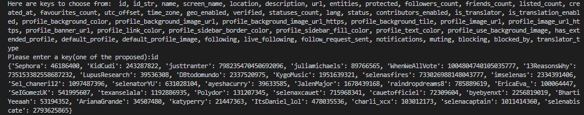
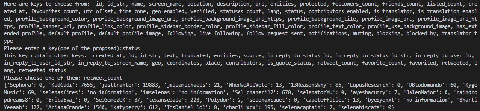

### json_parsing

This module parses the json file, that was received by Twitter API. It provides access to different parts of json file. The user can enter a key of the dictionary and program will give the value that matches such a key. Before entering the key, the user will see what keys are available. If the key contains other keys, user can сhoose another key from smaller dictionary. To the user is returned the dictionary that contains the "screen_name" of the user as a key and as the value information that was received from the inputted key. If there is no information from the inputted key, then the value of new dictionary is “no information”.

### Examples of module’s work

### Сonclusion
This module helps to receive the information that interests the user. Moreover, user can see whose profile in Twitter has such information.

### Author 
Khristina Kokolus
